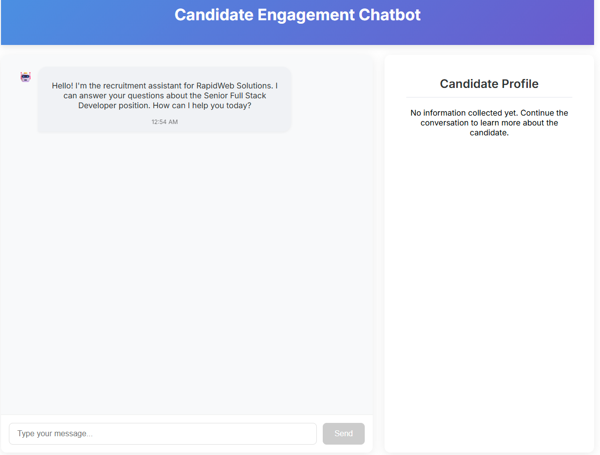
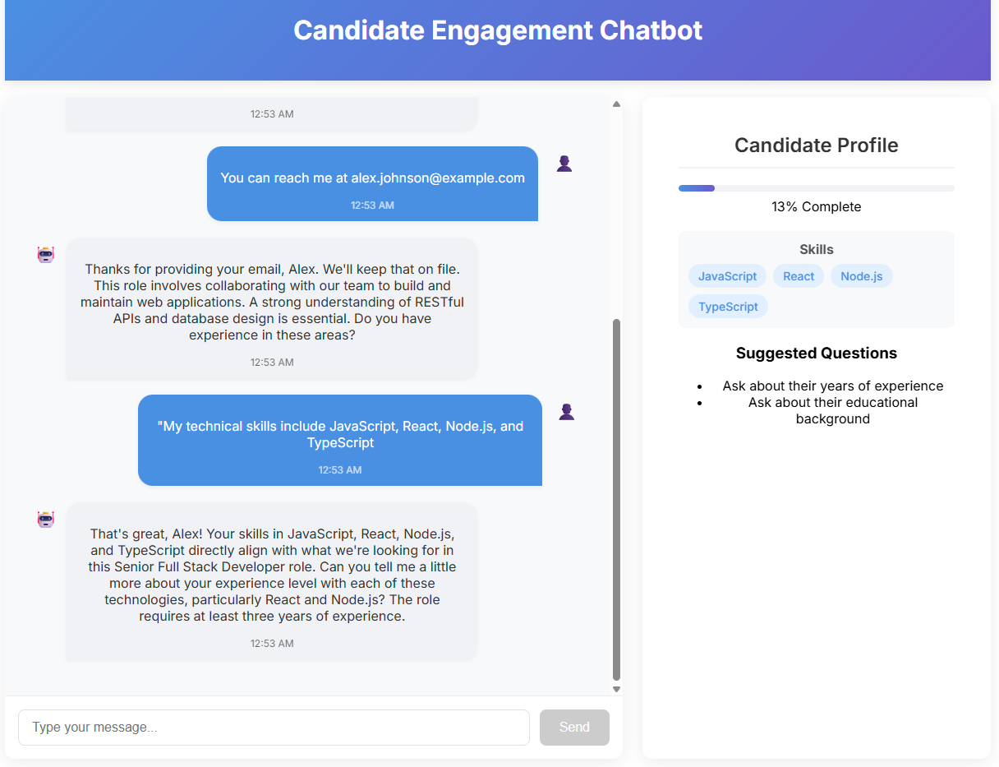

# Candidate Engagement Chatbot

A specialized chatbot that engages job applicants with contextually relevant information while qualifying their fit. This application is designed to help recruiters screen candidates for a specific job. It uses a combination of natural language processing and machine learning to extract relevant information from the candidate's responses and build a structured profile.

## Features

- Chat interface for candidates to ask questions about a job
- Contextually relevant responses based on job description
- Automatic extraction of candidate information during conversation
- Profile summary showing what the system learned about the candidate

## Application Screenshots

### Initial Chat Interface


### Conversation with Profile Building


## Technical Stack

- **Frontend**: React with TypeScript
- **Backend**: Node.js with Express and TypeScript
- **State Management**: React Context API
- **LLM Integration**: Google's Gemini API

## Conversation Design Approach

The chatbot is designed to:

1. **Provide job information**: Answer candidate questions about the role, requirements, benefits, etc.
2. **Extract candidate information**: Analyze candidate messages to extract relevant qualifications
3. **Maintain context**: Keep track of the conversation flow and previously discussed topics
4. **Generate a profile**: Build a structured candidate profile from unstructured conversation

## Information Extraction Approach

The system extracts candidate information by:

1. Analyzing each message for relevant information (skills, experience, education, etc.)
2. Assigning confidence scores to extracted information
3. Building a candidate profile incrementally as the conversation progresses
4. Updating the profile when new information with higher confidence is detected

## Technical Decisions and Tradeoffs

- **React Context API vs Redux**: Used Context API for simplicity, though Redux would offer better scalability for larger applications
- **Google Gemini API vs OpenAI**: Used Gemini for its strong performance in structured data extraction
- **In-memory Storage vs Database**: Used in-memory storage for simplicity, though a real application would use a database
- **Confidence-based Extraction vs Rule-based**: Used confidence scores to determine which information to keep, allowing for more flexible extraction

## Setup Instructions

### Prerequisites

- Node.js (v14 or higher)
- npm or yarn
- Google Gemini API key

### Installation

1. Clone the repository:
   ```
   git clone https://github.com/yourusername/candidate-chatbot.git
   cd candidate-chatbot
   ```

2. Install dependencies for both client and server:
   ```
   # Install server dependencies
   cd server
   npm install

   # Install client dependencies
   cd ../client
   npm install
   ```

3. Create a `.env` file in the server directory:
   ```
   PORT=3001
   GEMINI_API_KEY=your_api_key_here
   ```

### Running the Application

1. Start the server:
   ```
   cd server
   npm run dev
   ```

2. Start the client:
   ```
   cd client
   npm start
   ```

3. Open your browser and navigate to `http://localhost:3000`

## Future Enhancements

With more time, the following enhancements could be made:

1. **Improved Information Extraction**:
   - More sophisticated NLP techniques for entity recognition
   - Better handling of ambiguous or conflicting information
   - Extraction of more nuanced information like soft skills and cultural fit

2. **Enhanced Conversation Capabilities**:
   - More natural conversation flow with better context management
   - Proactive questions to fill gaps in candidate profile
   - Personalized follow-up questions based on previous responses

3. **Advanced Profile Building**:
   - More sophisticated merging of information over time
   - Confidence-based validation of extracted information
   - Ability for candidates to review and correct extracted information

4. **Integration and Scalability**:
   - Database storage for conversations and profiles
   - Integration with ATS (Applicant Tracking System)
   - Support for multiple job descriptions
   - Authentication and user management

5. **Analytics and Insights**:
   - Dashboard for recruiters to view candidate insights
   - Comparative analysis of candidates
   - Automated qualification scoring
